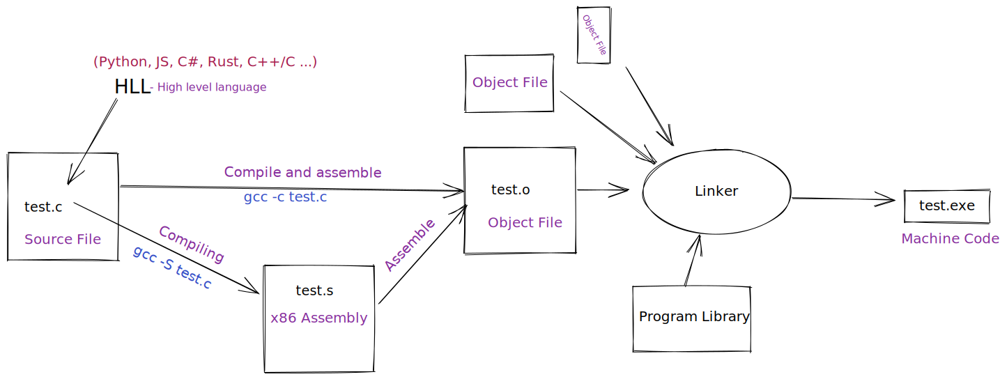

# Implementing linked list knowing little about C\#

- Compile time - во время компиляции = значит до запуска программы
- Run time - во время работы программы = после запуска
- Runtime (слитно) - среда выполнения кода =
  - Виртуальная Машина (в случае C\# -- .NET CLR / Java -- JVM ) или ОС (в случае C/C++)
    - \+ все библиотеки, которые нужны для выполнения программы

- Свойства через C\# {get; set; } -- свойства с автоматическими методами = авто-свойства (auto-property)
- Исключения (*) - это способ вызвать распространение "контролируемой ошибки", в случае когда логика в конкретном месте не может справится с ошибкой.
  - если для созданного исключения не существует обработчиков, выполнение программы прекращается с сообщением об ошибке.
- VM - виртуальная машина - "операционная система" внутри ОС
- [ ] [Интерполяция строк](https://docs.microsoft.com/ru-ru/dotnet/csharp/language-reference/tokens/interpolated)

___
15.09.22

- `internal <class>` - доступ к классу внутри сборки = грубо говоря внутри проекта .csproj
- рефлексия .NET - возможность получать доступ (и модифицировать) в run time к данным о данных выполняющегося сейчас кода (внутри сборки)
- интерфейс - контракт, указывающий, какие методы (включая сигнатуру - название метода, тип аргументов и тип возвращаемого значения), класс, или структура должны реализовывать, чтобы выполнять этот контракт
  - интерфейс в C\# является типом, а соответственно типы, выполняющие его - его подтипами

___
17.09.22

- Ограничения параметров типа, пример:
  - `class List<T> : IList<T> where T: notnull` - синтаксис позволяющий задать ограничения для типов в compile time.

- Индексеры:
    Индексаторы позволяют индексировать объекты так же, как и массивы или другие коллекции.

    ```csharp
    public T this[int index]
    {
      get => GetAt(index);
      set => SetAt(index, value);
    }
    ```

- Компиляция и исполнение C/C++ vs C#:
  - C/C++ 
    => Компилируется в машинный код (бинарники под разную архитектуру - x86 vs ARM - не заработают в другой) который исполняется ОС/ЦПУ
  - C\# - компилируется в байт-код - IL (Intermediate Language) = CIL = MicroSoft Common Intermediate Language, **который исполняет виртуальная (магическая) машина** - CLR (Common Language Runtime) - он стандартизирован (существует "священная" [документация ECMA 335](https://www.ecma-international.org/publications-and-standards/standards/ecma-335/) в которой подробно описано как он работает) и называется Common Language Infrastructure (CIL)  
  -> множество языков исполняются на одной "платформе" (Компилятор + CLR)
